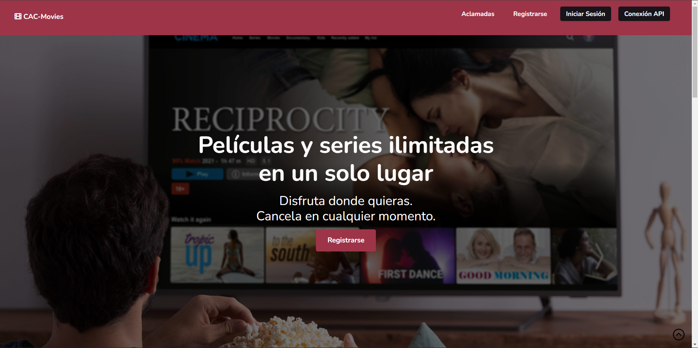
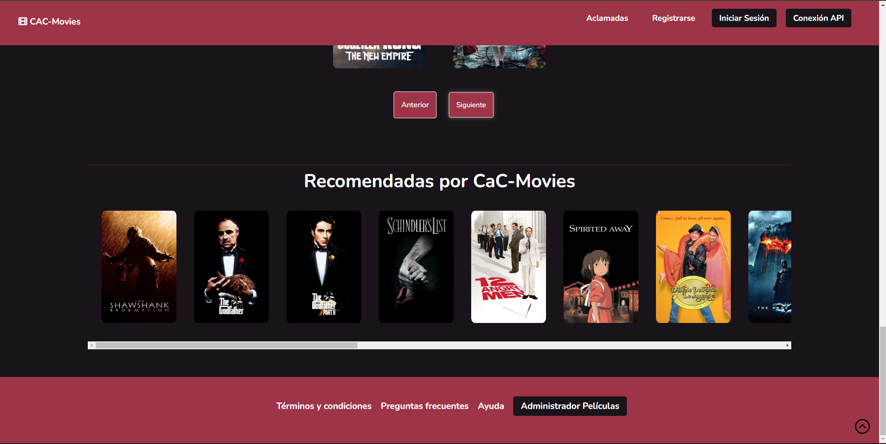
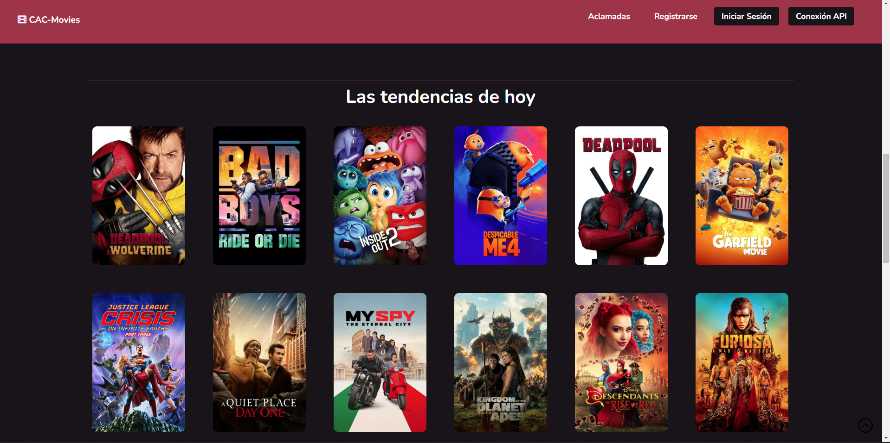

<em> # CaC-Movies </em>

# 🎥 Webapp CaC-Movies

## 📝 Descripción

Esta aplicación Web forma parte del Proyecto Final a presentar en el programa Codo a Codo de la Ciudad de Buenso Aires, se trata de desarrollar una aplicación web con temática de películas.

Esta formado por un Front-End desarrollado con Html 5, estilos CSS y con Javascript, conectada con un Back-End en Java vía Servlets en un server Tomcat versión 9.

Entre los archivos encontraran: cac_movies.sql => script para crear la base de datos cac_movies y sus tablas login, peliculas y registrosusuarios

## ✅ Requisitos

- Front-End con HTML, CSS y Javascript
- Back-End con Base de Datos MySQL y desarrollo en Java con Servlets.
- Consumir una API de Internet.
- Consultar la Base de Datos y mostrar resultados.

## 🎬 Funcionamiento
La aplicación desarrollada con Html 5, estilos CSS y con Javascript, permite navegación entre opciones del Navbar, animaciones en iconos, mostrar peliculas, mostrar un carrousel, registrar usuarios, validar campos al registrarse y consumir una API de peliculas alojados en https://api.themoviedb.org/3 al que tuve que suscribirme para tener una APIKEY. Esta conectada con un Back-End en Java vía Servlets se comunica con web-server Tomcat version 9, para registrar usuarios en la base de datos MySQL mediante la opción Registrarse, también puede validar un login de administrador para mostrar/modificar y eliminar una lista de usuarios registrados, mediante un modal. Como adicional existe un botón de consumo de API que muestra listado de películas que trae de la API de The MovieDB, la opción Aclamadas del Navbar que permite consultar la base de datos y mostrar las películas Aclamadas y un buscador que consulta la base de datos para mostrar el resultado de la busqueda en un modal.

## 💻 Vistas:

## 👷Autor: Alberto Vallecillo

